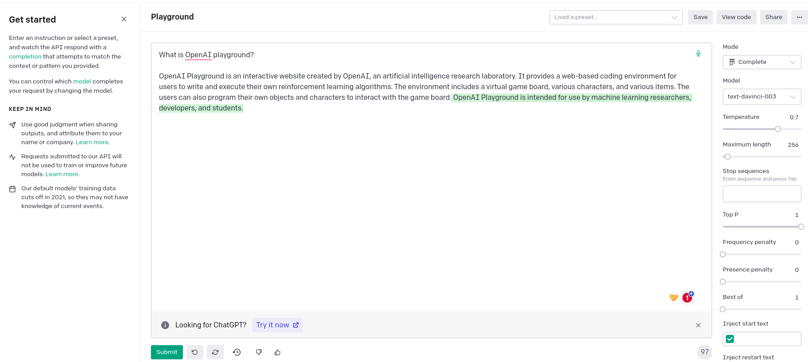

# OpenAI-GPT-ChatGPT-DALL-E
- Recent release of `ChatGPT` by OpenAI has got lots of attractions including developers, researchers, CEOs, students, etc.
- Almost all of the peoples including both tech and non-tech are using ChatGPT to solve their queries or even integrate it to their existing applications to make product more intelligent.
- In this repo, I'll be explaining all of the details related OpenAI, GPT, ChatGPT, DALL-E. By the end you will master those concepts and even integrate it to your dream projects.
- **prerequisities:**
    - Basic Programming Skills (python preferrable)

# Table of Content
1. Introduction and Prompt Engineering
2. Writing code and Calling the API
3. Dall-E and Codex
4. Fine-Tuning
5. Embedding
6. Writing and Managing Chatbots


## 1. Introduction and prompt Engineering
### 1.1 OpenAI playground  
- OpenAI playground is a place where you can have a try of OpenAI services (like code completion, Embeddings, Q&A etc) without writing any code with an option to extract code generated by OpenAI itself.
- To use the playground you need to logged in to [OpenAI](https://openai.com/)
- Generate OpenAI API Key [Click Here](https://platform.openai.com/account/api-keys)
    - `Note:` Incase of free API Key, Services maybe limited.
- To access OpenAI Playground [Click Here](https://platform.openai.com/playground)
- **Experiment**
    - 
- `Note:` OpenAI recommends to use **text-davinci-003** model.

### 1.2 Prompt Engineering

**A good Prompt message has following characteristics**  
 - Make the intent clear 
 - Add some examples so the AI can recognize a pattern or determine valid options
 - Start some text or describe a problem (with or without some rules)
 - Leave something for the AI to complete.   


**Keywords for getting longer prompt response**
 - longer response
 - add more description
 - in more details
 - elaborate it
 - explain it
 - provide detailed explanation
 - explain the case in more detail
 - explain your reasoning and so on.  

### Prompt Design 1

 - **Prompt #1 (to write a blog post)**    
    ```
    """
    You are an assistant helping to draft a blog post based on a prompt. The blog post should have an introduction, 3 topic paragraphs, and a conclusion.  

    Use this format, replacing text in brackets with the result. Do not include the brackets in the output:  

    Blog post:
    # [Title of blog post]
    [Content based on the prompt]
    """

    Large Language Model tools\n
    ```
- **Prompt #2 (to summarize a document)**  
    ```
    """
    You are an assistant helping to summarize a document based on a prompt. 
    
    Use this format, replacing text in brackets with the result. Do not include the brackets in the output.

    Summary:
    [One paragraph summary of the document]
    """

    <prompt always goes here>
    ```
- **Prompt #3 (to write an essay)**
    ```
    """
    You are an assistant helping to write an essay based on a prompt.
    
    Use this format, replacing text in brackets with the result. Do not include the brackets in the output.

    Essay:
    [Introduction paragraph]

    ## [Name of topic 1]
    [paragraph about topic 1]

    ## [Name of topic 2]
    [paragraph about topic 2]

    ## [Name of topic 3]
    [paragraph about topic 3]

    ## ['Conclusion']
    [conclusion paragraph]
    """

    AI Hackathon  
    ```

- **Prompt #4 (to draft a social media post)**
    ```
    """
    You are an assistant helping to draft a social media post. The post should include interesting emojis, relevant hashtag.

    Use this format replacing text in brackets with the result. Do not include the brackets in the output

    Social Media Post:
    # [Post Title]
    [one paragraph post body]
    Tags: [List of relevant #hashtags]
    """
    3 students (Ram, Gita, Sita) got selected on Voice of Kids Nepal who are students of ECA Academy Nepal
    ```

### Prompt Design 2

```
You are music lyrics writer writing brand new hindi lyrics for bout engineering life. Reference is attached herewith

"""
कब मिलेंगे ना जाने हम! यारों फिर से सभी
लौट कर अब ना आयेंगे, वो मस्ती भरे दिन कभी
हो, दिल ये अपना कहे, कि ऐ दोस्तों

कब मिलेंगे ना जाने हम! यारों फिर से सभी
लौट कर अब ना आयेंगे, वो मस्ती भरे दिन कभी
हो, दिल ये अपना कहे, कि ऐ दोस्तों
"""
```


_**Note**: using similar pattern/template you can receive more appealing and interesting response from ChatGPT_
